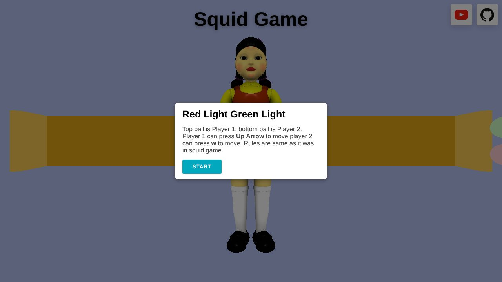
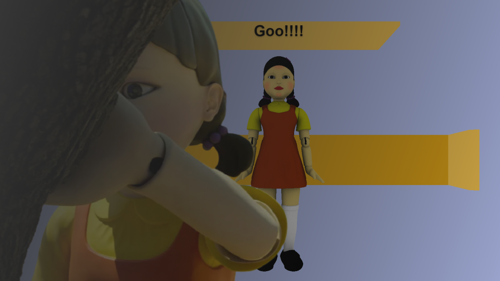

# 🦑 Red Light, Green Light — 3D Browser Game

A two-player 3D browser game inspired by the "Red Light, Green Light" round from the TV series *Squid Game*, built with **Three.js** and **GSAP**.


<p align="center"></p>

## 🎮 How to Play

1. Press **Start** — a 3-second countdown begins.
2. While the doll faces away (**green light**), hold your key to move toward the finish line.
3. When the doll turns around (**red light**), **stop**. If you're caught moving, you're out.
4. Reach the finish line before the **15-second** timer runs out.

| Player | Key |
|--------|-----|
| Player 1 | `↑` Arrow Up |
| Player 2 | `W` |

## ✨ Features

- 3D doll model loaded with Three.js's `GLTFLoader`
- Doll turning animated with GSAP
- Countdown timer with an animated progress bar
- Win / lose / time-out messages for each player
- Background music and win/lose sound effects

## 📁 Project Structure

```
├── index.html      # Page and UI
├── main.js         # Game logic
├── GLTFLoader.js   # Three.js glTF model loader
├── gsap.min.js     # Animation library
├── model/          # 3D doll model and textures
├── music/          # Background music and sound effects
└── img/            # Preview image
```

## 🚀 Getting Started

1. Clone the repo:
   ```bash
   git clone https://github.com/Scarface96/squid-game.git
   ```
2. `index.html` loads `three.min.js` from the project folder. Download it from the [Three.js releases](https://github.com/mrdoob/three.js/releases) and place it next to `index.html`.
3. Serve the folder with a local web server (the 3D model won't load from `file://`), e.g.:
   ```bash
   npx serve .
   ```

## 🙏 Credits

- Built by following the [YouTube tutorial](https://youtu.be/7bTuSZ94F6A) by **0shuvo0** — [original game](https://0shuvo0.github.io/squidgame/).
- 3D model: ["Squid Game - Giant Doll"](https://sketchfab.com/3d-models/squid-game-giant-doll-7afd49dd07714651a6afa1fc4aac8576) by [Rzyas](https://sketchfab.com/rzyas), licensed under [CC BY 4.0](http://creativecommons.org/licenses/by/4.0/).
- Error tone sound effect from [ZapSplat](https://www.zapsplat.com/).

[](https://youtu.be/7bTuSZ94F6A)

---

👤 **Tony Mulunda** — [GitHub @Scarface96](https://github.com/Scarface96)
